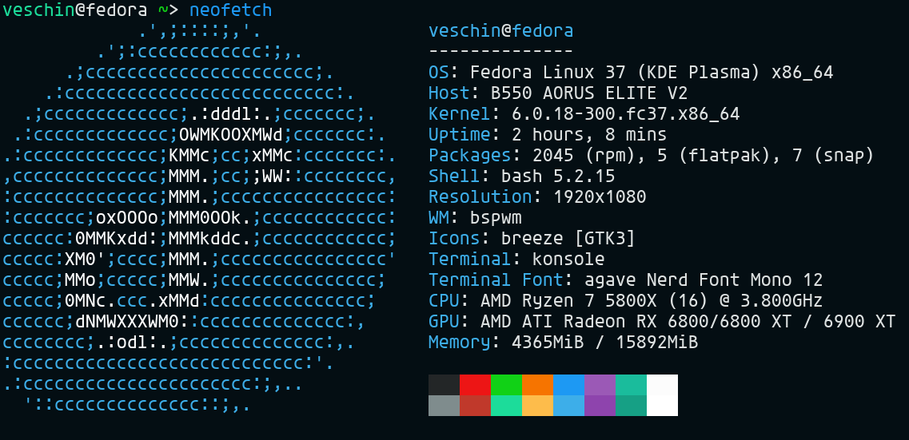
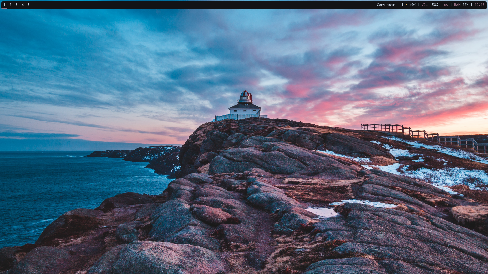
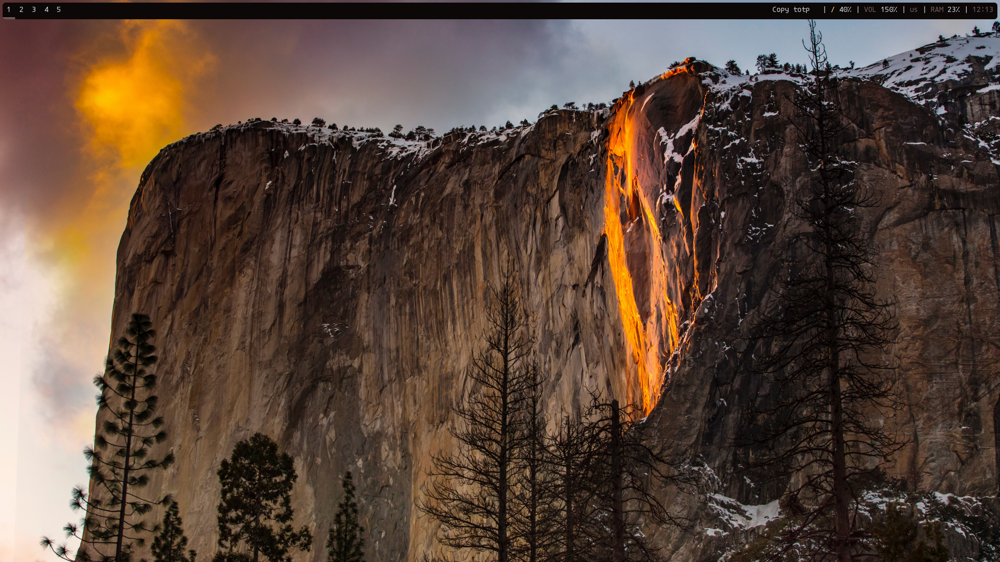
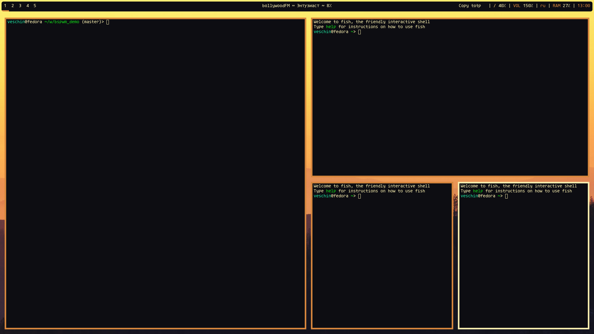
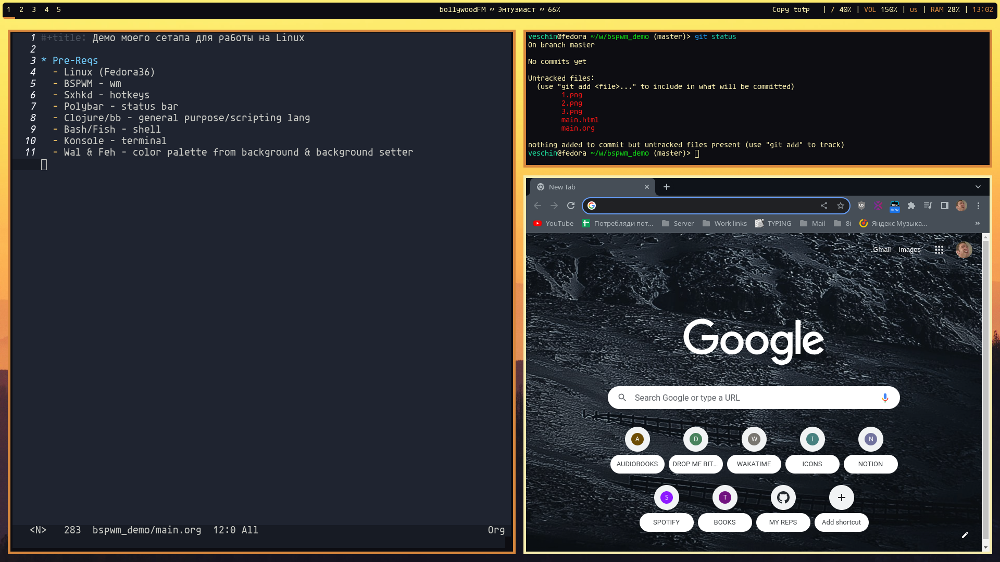

- [Specs](#orgec4234e)
- [Pre-Reqs](#org07d5db5)
- [Backgrounds and colors](#org41c4da1)
  - [`~/.config/bspwm/bspwmrc`](#orgea3c08d)
- [Work layout](#org33b1f32)
  - [Binary layout](#orgebf8690)
  - [Real example](#org0008a37)
- [Single monitor with 5 desktops](#org6c7a2b5)
  - [`~/.config/bspwm/bspwmrc`](#orgce8f164)
- [Rules for some apps](#org803aff1)
  - [`~/.config/bspwm/bspwmrc`](#org07c3721)
- [Some hotkeys in sxhkd](#orge3554d5)
  - [`~/.config/sxhkd/sxhkdrc`](#orgde967a9)
- [Bspc hotkeys](#orgc1c68a3)
  - [`~/.config/sxhkd/sxhkdrc`](#orga342a4f)


<a id="orgec4234e"></a>

# Specs




<a id="org07d5db5"></a>

# Pre-Reqs

-   Linux (Fedora36)
-   BSPWM - wm
-   Sxhkd - hotkeys
-   Polybar - status bar
-   Clojure/bb - general purpose/scripting lang
-   Bash/Fish - shell
-   Konsole - terminal
-   Wal & Feh - color palette from background & background setter


<a id="org41c4da1"></a>

# Backgrounds and colors

  


<a id="orgea3c08d"></a>

## `~/.config/bspwm/bspwmrc`

```bash
wallpaper=`find ~/wallpapers/ | sort -R | head -1`
wal -i $wallpaper -n
feh --bg-fill $wallpaper --bg-fill $wallpaper
```


<a id="org33b1f32"></a>

# Work layout


<a id="orgebf8690"></a>

## Binary layout




<a id="org0008a37"></a>

## Real example




<a id="org6c7a2b5"></a>

# Single monitor with 5 desktops


<a id="orgce8f164"></a>

## `~/.config/bspwm/bspwmrc`

```bash
bspc monitor HDMI-A-0 -d 1 2 3 4 5
xrandr -s 1920x1080 -r 144

bspc config border_width         5
bspc config window_gap          15

bspc config split_ratio          0.52
bspc config borderless_monocle   true
bspc config gapless_monocle      true
```


<a id="org803aff1"></a>

# Rules for some apps


<a id="org07c3721"></a>

## `~/.config/bspwm/bspwmrc`

```bash
bspc rule -a Google-chrome desktop=3
bspc rule -a TelegramDesktop:telegram-desktop desktop=2
bspc rule -a Peek state=floating follow=on focus=on
```


<a id="orge3554d5"></a>

# Some hotkeys in sxhkd


<a id="orgde967a9"></a>

## `~/.config/sxhkd/sxhkdrc`

```bash
super + Return
	konsole

Print
	sudo kill -9 `pgrep flameshot` && \
	flameshot gui && \
	xclip -i `ls -d -r --no-icons $HOME/Pictures/* | head -1` \
	-selection clipboard \
	-target image/png

super + space
	rofi -show drun

alt + space
	rofi -show run
```


<a id="orgc1c68a3"></a>

# Bspc hotkeys


<a id="orga342a4f"></a>

## `~/.config/sxhkd/sxhkdrc`

```bash

# Move window
super + {Left,Down,Up,Right}
	bspc node -s {west,south,north,east}

# Cycle between windows
alt + {_,shift + }Tab
	bspc node -f {next,prev}.LOCAL

# Reload bspwm config
super + shift + r
	bspc wm -r && pkill -USR1 -x sxhkd

# Close window
super + w
	bspc node -c

# Move window to desktop
super + {_,alt +} {1-9}
	bspc {desktop -f,node -d} {1-9}
```