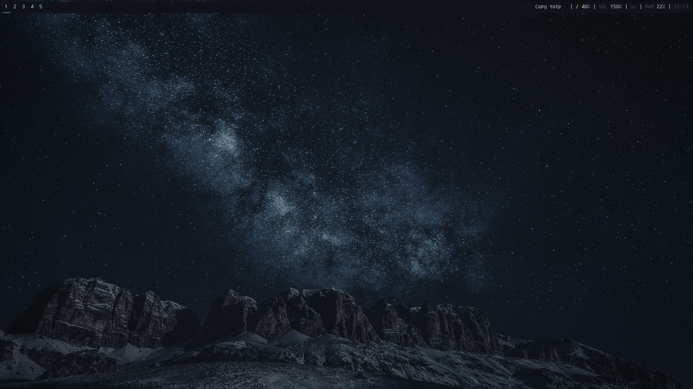

- [Specs](#org276c4c7)
- [Pre-Reqs](#org4477ceb)
- [Backgrounds and colors](#org479d19a)
  - [`~/.config/bspwm/bspwmrc`](#orgf2de29a)
- [Work layout](#orgc2efdf9)
  - [Binary layout](#orgb8a7b32)
  - [Real example](#orgca9904f)
- [Single monitor with 5 desktops](#orgc6115cb)
  - [`~/.config/bspwm/bspwmrc`](#org5a522f8)
- [Rules for some apps](#orgb04c873)
  - [`~/.config/bspwm/bspwmrc`](#orga52d20b)
- [Some hotkeys in sxhkd](#org0796ff5)
  - [`~/.config/sxhkd/sxhkdrc`](#org58eb94b)
- [Bspc hotkeys](#org1bda3d6)
  - [`~/.config/sxhkd/sxhkdrc`](#org3f87132)


<a id="org276c4c7"></a>

# Specs


<a id="org4477ceb"></a>

# Pre-Reqs

-   Linux (Fedora36)
-   BSPWM - wm
-   Sxhkd - hotkeys
-   Polybar - status bar
-   Clojure/bb - general purpose/scripting lang
-   Bash/Fish - shell
-   Konsole - terminal
-   Wal & Feh - color palette from background & background setter


<a id="org479d19a"></a>

# Backgrounds and colors

  


<a id="orgf2de29a"></a>

## `~/.config/bspwm/bspwmrc`

```bash
wallpaper=`find ~/wallpapers/ | sort -R | head -1`
wal -i $wallpaper -n
feh --bg-fill $wallpaper --bg-fill $wallpaper
```


<a id="orgc2efdf9"></a>

# Work layout


<a id="orgb8a7b32"></a>

## Binary layout


<a id="orgca9904f"></a>

## Real example


<a id="orgc6115cb"></a>

# Single monitor with 5 desktops


<a id="org5a522f8"></a>

## `~/.config/bspwm/bspwmrc`

```bash
bspc monitor HDMI-A-0 -d 1 2 3 4 5
xrandr -s 1920x1080 -r 144

bspc config border_width         5
bspc config window_gap          15

bspc config split_ratio          0.52
bspc config borderless_monocle   true
bspc config gapless_monocle      true
```


<a id="orgb04c873"></a>

# Rules for some apps


<a id="orga52d20b"></a>

## `~/.config/bspwm/bspwmrc`

```bash
bspc rule -a Google-chrome desktop=3
bspc rule -a TelegramDesktop:telegram-desktop desktop=2
bspc rule -a Peek state=floating follow=on focus=on
```


<a id="org0796ff5"></a>

# Some hotkeys in sxhkd


<a id="org58eb94b"></a>

## `~/.config/sxhkd/sxhkdrc`

```bash
super + Return
	konsole

Print
	sudo kill -9 `pgrep flameshot` && \
	flameshot gui && \
	xclip -i `ls -d -r --no-icons $HOME/Pictures/* | head -1` \
	-selection clipboard \
	-target image/png

super + space
	rofi -show drun

alt + space
	rofi -show run
```


<a id="org1bda3d6"></a>

# Bspc hotkeys


<a id="org3f87132"></a>

## `~/.config/sxhkd/sxhkdrc`

```bash

# Move window
super + {Left,Down,Up,Right}
	bspc node -s {west,south,north,east}

# Cycle between windows
alt + {_,shift + }Tab
	bspc node -f {next,prev}.LOCAL

# Reload bspwm config
super + shift + r
	bspc wm -r && pkill -USR1 -x sxhkd

# Close window
super + w
	bspc node -c

# Move window to desktop
super + {_,alt +} {1-9}
	bspc {desktop -f,node -d} {1-9}
```