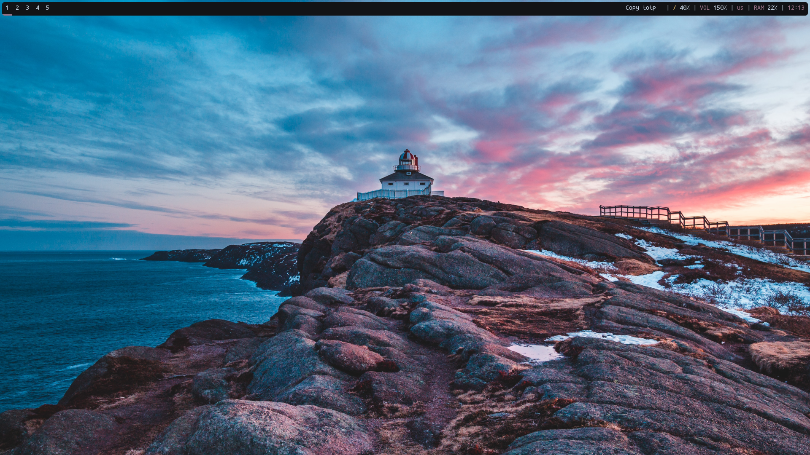
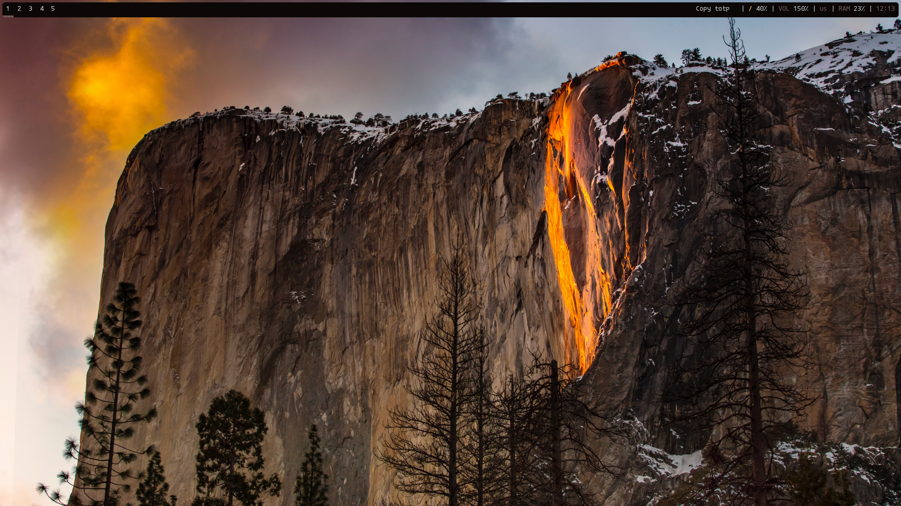
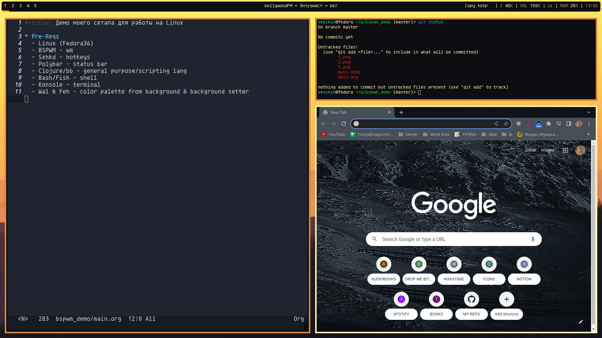

- [Pre-Reqs](#org3783b20)
- [Backgrounds and colors](#orgd773ba8)
  - [`~/.config/bspwm/bspwmrc`](#org5bd59fe)
- [Work layout](#org585c307)
  - [Binary layot](#org2020cae)
  - [Real example](#orgaee4b3d)
- [Single monitor with 5 desktops](#orgdfe9c76)
  - [`~/.config/bspwm/bspwmrc`](#orge47dc38)
- [Rules for some apps](#org965d69a)
  - [`~/.config/bspwm/bspwmrc`](#orgf3e4009)
- [Some hotkeys in sxhkd](#orgca01bba)
  - [`~/.config/sxhkd/sxhkdrc`](#org2db4bd9)
- [Bspc hotkeys](#org0010e77)
  - [`~/.config/sxhkd/sxhkdrc`](#orgfa1cf07)


<a id="org3783b20"></a>

# Pre-Reqs

-   Linux (Fedora36)
-   BSPWM - wm
-   Sxhkd - hotkeys
-   Polybar - status bar
-   Clojure/bb - general purpose/scripting lang
-   Bash/Fish - shell
-   Konsole - terminal
-   Wal & Feh - color palette from background & background setter


<a id="orgd773ba8"></a>

# Backgrounds and colors

  


<a id="org5bd59fe"></a>

## `~/.config/bspwm/bspwmrc`

```bash
wallpaper=`find ~/wallpapers/ | sort -R | head -1`
wal -i $wallpaper -n
feh --bg-fill $wallpaper --bg-fill $wallpaper
```


<a id="org585c307"></a>

# Work layout


<a id="org2020cae"></a>

## Binary layot


<a id="orgaee4b3d"></a>

## Real example




<a id="orgdfe9c76"></a>

# Single monitor with 5 desktops


<a id="orge47dc38"></a>

## `~/.config/bspwm/bspwmrc`

```bash
bspc monitor HDMI-A-0 -d 1 2 3 4 5
xrandr -s 1920x1080 -r 144

bspc config border_width         5
bspc config window_gap          15

bspc config split_ratio          0.52
bspc config borderless_monocle   true
bspc config gapless_monocle      true
```


<a id="org965d69a"></a>

# Rules for some apps


<a id="orgf3e4009"></a>

## `~/.config/bspwm/bspwmrc`

```bash
bspc rule -a Google-chrome desktop=3
bspc rule -a TelegramDesktop:telegram-desktop desktop=2
bspc rule -a Peek state=floating follow=on focus=on
```


<a id="orgca01bba"></a>

# Some hotkeys in sxhkd


<a id="org2db4bd9"></a>

## `~/.config/sxhkd/sxhkdrc`

```bash
super + Return
	konsole

Print
	sudo kill -9 `pgrep flameshot` && \
	flameshot gui && \
	xclip -i `ls -d -r --no-icons $HOME/Pictures/* | head -1` \
	-selection clipboard \
	-target image/png

super + space
	rofi -show drun

alt + space
	rofi -show run
```


<a id="org0010e77"></a>

# Bspc hotkeys


<a id="orgfa1cf07"></a>

## `~/.config/sxhkd/sxhkdrc`

```bash

# Move window
super + {Left,Down,Up,Right}
	bspc node -s {west,south,north,east}

# Cycle between windows
alt + {_,shift + }Tab
	bspc node -f {next,prev}.LOCAL

# Reload bspwm config
super + shift + r
	bspc wm -r && pkill -USR1 -x sxhkd

# Close window
super + w
	bspc node -c

# Move window to desktop
super + {_,alt +} {1-9}
	bspc {desktop -f,node -d} {1-9}
```